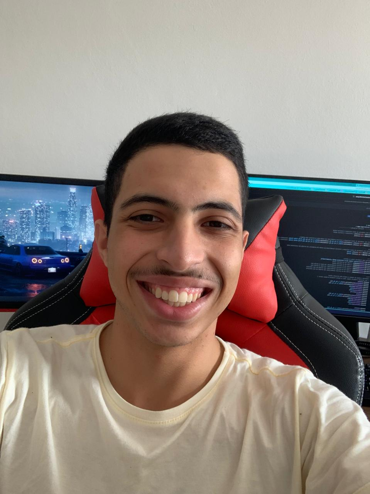

Olá! meu nome é Alexandre e tenho 20 anos!
Atualmente cursando o 3º semestre de Tecnologia em Sistemas para Internet no IFSUL - Câmpus Pelotas.
Tenho alguns projetos desenvolvidos, sendo os mais relevantes um Jogo de Batalha naval Feito em C, Um Mod de Minecraft em Java e outros projetos em andamento.
Agora Sobre Hobbies, Curto Jogar CS e jogos de estratégia no tempo livre, mas também gosto de passar tempo com a família.

