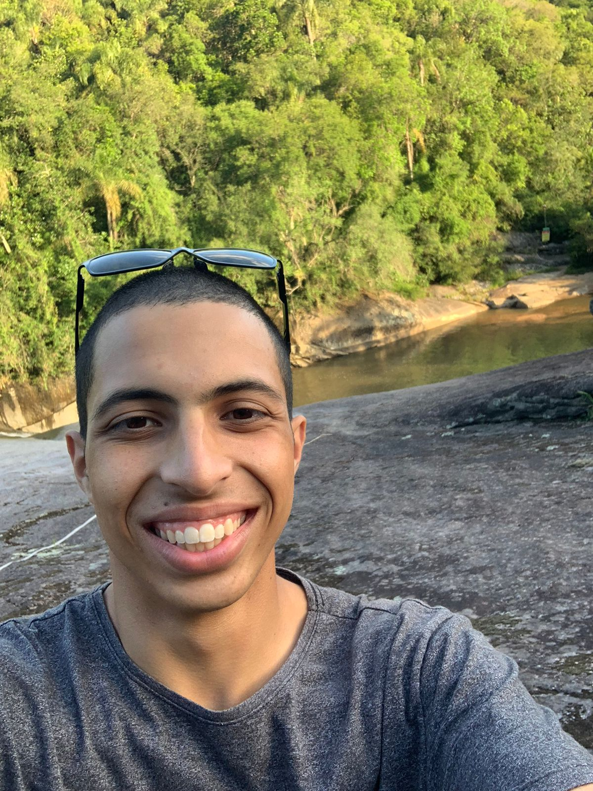

# Olá! meu nome é Alexandre e tenho 20 anos! :smile:

## Sobre mim

Resido em Pelotas e estou cursando o 3º semestre de Tecnologia em Sistemas para Internet no IFSUL - Câmpus Pelotas.

---

## Projetos:

- Um Jogo de Batalha naval Feito em C
- Um Mod de Minecraft em Java
- Um site de compra e venda de carros (Ainda em Desenvolvimento)

---

- Experiência: Tive experiência como técnico de infomática no Exército Brasileiro em manutenção de hardware e software, em que trabalhava quase 100% com sistemas linux(Na maioria dos casos Ubuntu).
- Conhecimentos: Tenho conhecimento em C, Java, Python, PHP, HTML, CSS, JavaScript, SQL, Git e Linux.
- Hobbies: Jogar CS e jogos de estratégia no tempo livre.

## O que Estou Aprendendo

### Git e GitHub

Neste curso, Vi a parte fundamental e avançada sobre git e alguns dos seus comandos, como git init, git add, git commit, git push, git pull, git branch e entre outros.

### Linux

No curso de Linux, vi desde o básico até o avançado em sistemas linux utilizando somente o terminal.

### SQL

No Curso de SQL, vi desde o básico até o avançado na área de análise de dados. Este curso tem um desafio final que é muito interessante para praticar.

### Python

No Curso de Python, vi desde o básico até o avançado na área de programação e lógica.

### Docker

Neste curso, vi desde o básico até o avançado em Docker, como criar imagens, containers, volumes e redes.

### AWS - Cloud Quest e Skill Builder

Nesses cursos, vi o básico em alguns serviços AWS, como S3, RDS, EC2, IAM, VPC, DynamoDB, Redshift, Glue, Athena.

## Sprints

- [Sprint 1](Sprint%201/README.md)
- [Sprint 2](./Sprint%202/README.md)
- [Sprint 3](./Sprint%203/README.md)
- [Sprint 4](./Sprint%204/README.md)
- [Sprint 5](./Sprint%205/README.md)
- [Sprint 6](./Sprint%206/README.md)
- [Sprint 7](./Sprint%207/README.md)
