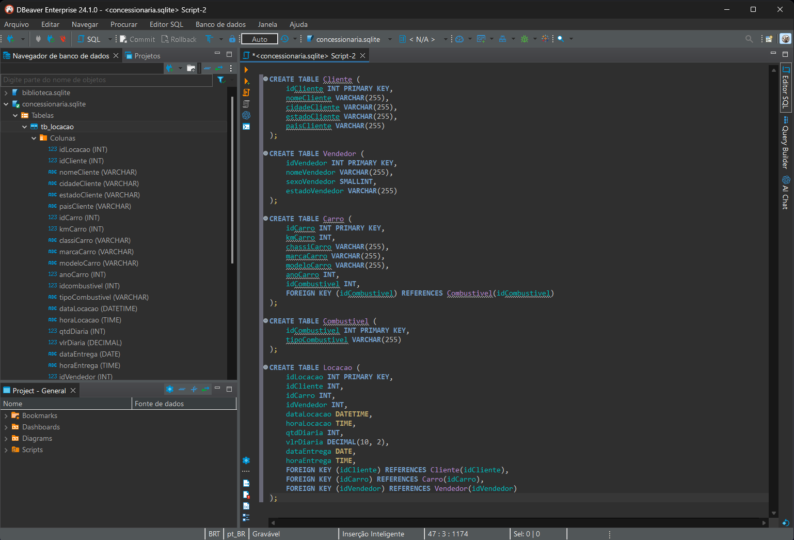
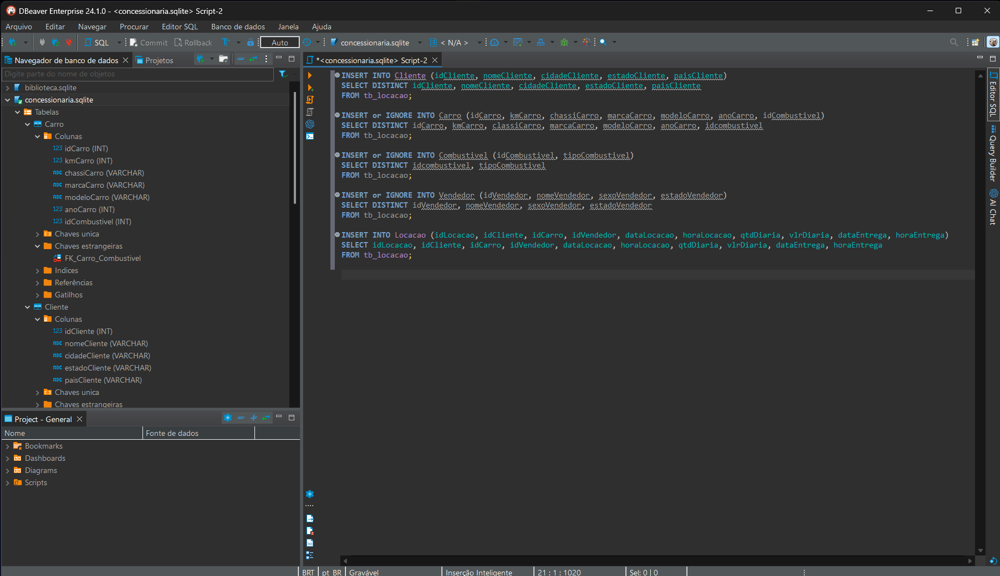
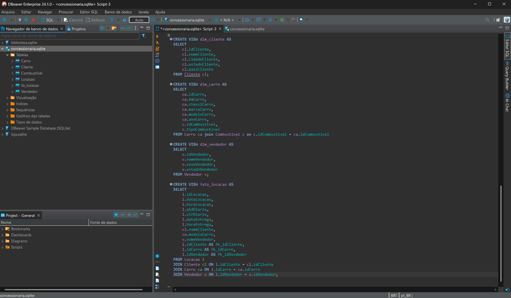
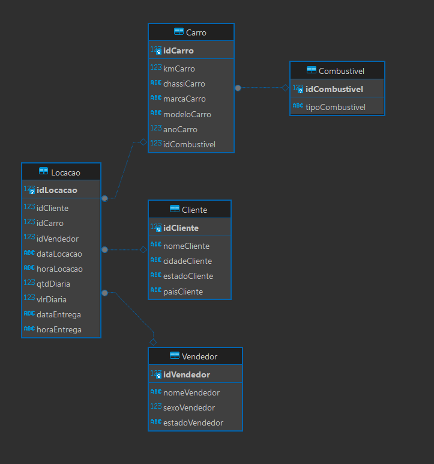

# Desafio

1. [Pasta do Desafio](./Desafio/)

# Exercícios

1.  [Seção 3](./exercicios/Secao3/)

2.  [Seção 4](./exercicios/Secao4/)

3.  [Seção 6](./exercicios/Secao6/)

# Evidências

Normalizando o banco de Dados criando as tabelas novas

Inserindo os dados nas tabelas novas

Criando as views

Como Ficou o modelo Relacional Dentro do Dbeaver

# Certificados

- Certificado do Curso AWS Partner: Sales Accreditation
  
