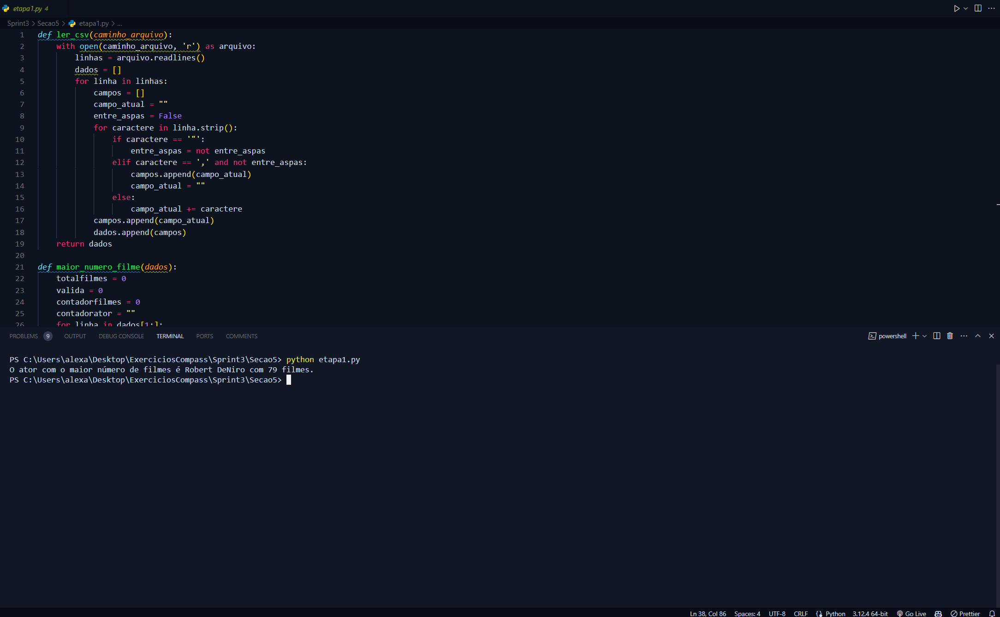
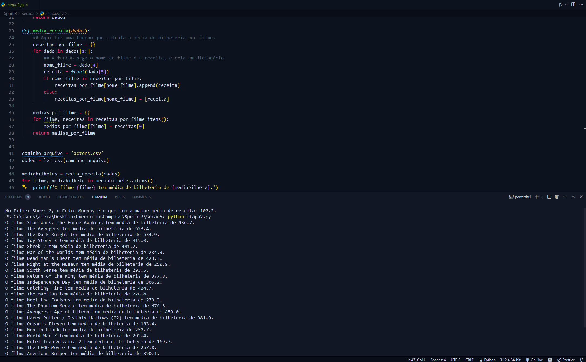
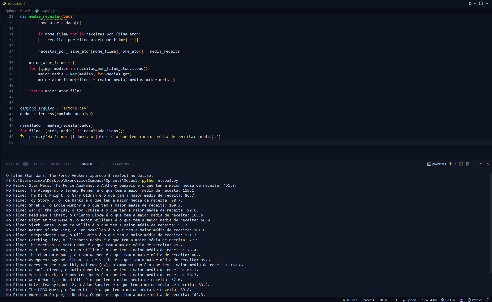
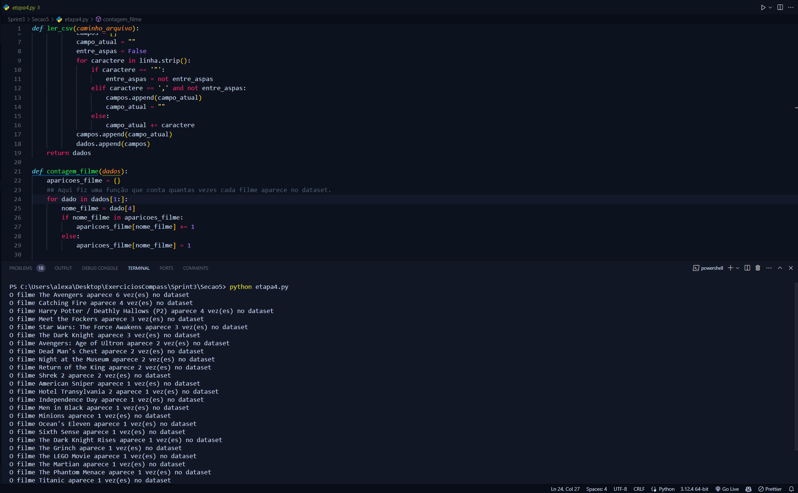
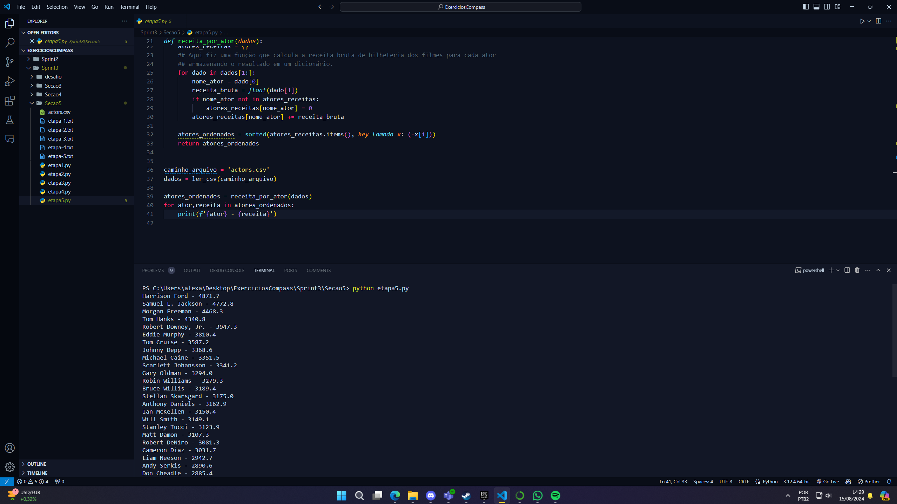

# Desafio

1. [Pasta do Desafio](./Desafio/)

# Exercícios

Os exercícios foram divididos em seções, onde cada seção possui um diretório com os exercícios resolvidos.
Abaixo estão os links para cada seção com os exercícios resolvidos em Python.

- [Seção 3](./exercicios/Secao3/)
- [Seção 4](./exercicios/Secao4/)

Na seção 5, as etapas do exercícios foram salvas em arquivo txt pois no material era solicitado que fosse feito desta forma.

- [Seção 5](./exercicios/Secao5/)

# Evidências

Segue as evidências dos exercícios da seção 5:

Nestas evidências mostro em execução o código de cada etapa do exercício da seção 5.

Evidência 1: Etapa 1

Evidência 2: Etapa 2

Evidência 3: Etapa 3

Evidência 4: Etapa 4

Evidência 5: Etapa 5

# Certificados

- Certificado do Curso AWS Partner: Economias na Nuvem AWS
  
