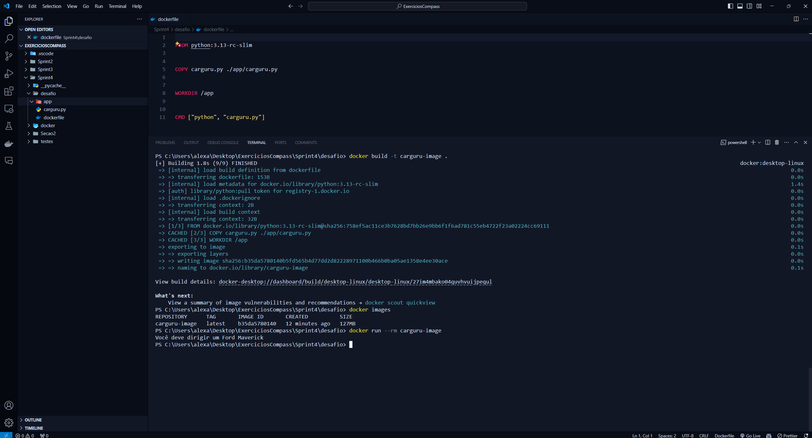
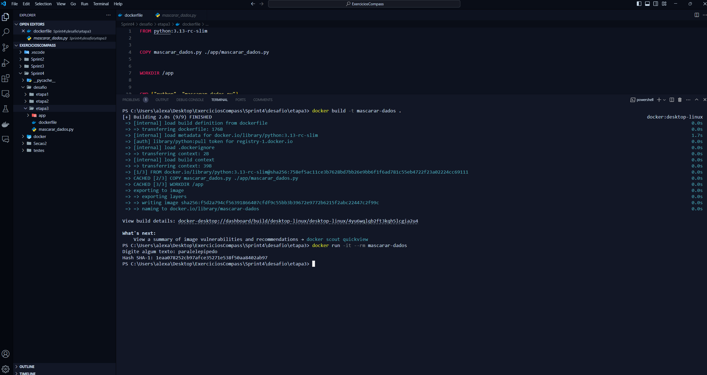
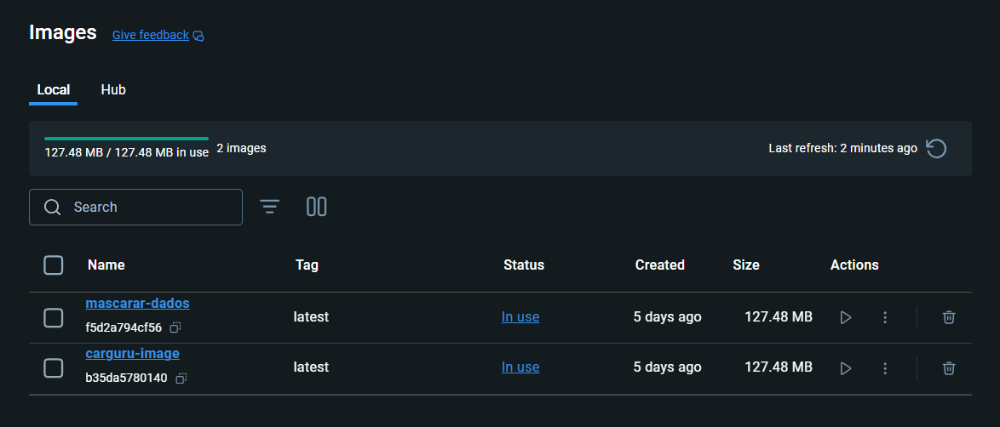

# Desafio

1. [Pasta do Desafio](./Desafio/)

# Exercícios

Abaixo está o link para a seção dos exercícios resolvidos em Python.

- [Seção 2](./exercicios/Secao2/)

# Evidências

Seguem as evidências da resolução do Desafio:

Evidência 1: Etapa 1

Evidência 2: Etapa 3

Evidência 3: Print das imagens no Docker

# Certificados

- Certificado do Curso AWS Partner: Elementos Técnicos essenciais de AWS
  

- Certificado do Curso AWS Partner: Credenciamento técnico da AWS
  
