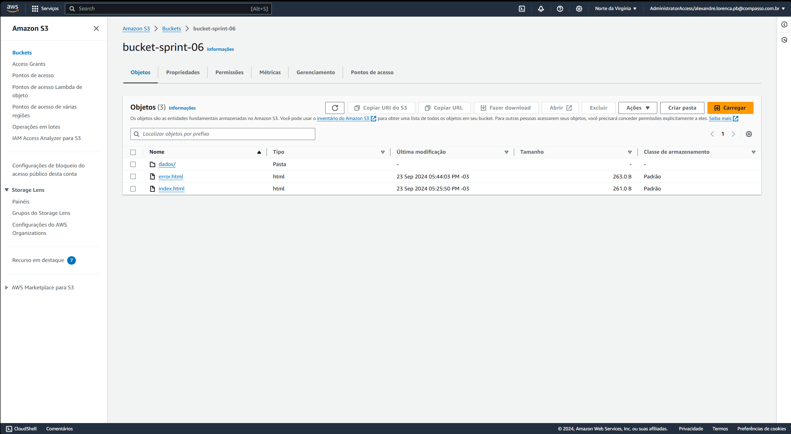

# Desafio

1. [Pasta do Desafio](./Desafio/)

# Exercícios

1. [Exercício 1](./Exercicios/ex1/)
2. [Exercício 2](./Exercicios/ex2/)
3. [Exercício 3](./Exercicios/ex3/)

# Evidências

Evidência 1: Exercício 1 - S3 Bucket

Evidência 2: Exercício 1 - Site Estático

Evidência 3: Exercício 2 - AWS Athena

Evidência 4: Exercício 3 - Layer Pandas

Evidência 5: Exercício 3 - AWS lambda

Evidência 6: limpeza de arquivos

Evidência 7: Desafio - Execução

Evidência 8: Desafio - S3

# Certificados

- Certificado do Curso Noções básicas de Analytics na AWS – Parte 1
  

- Certificado do Curso Noções básicas de Analytics na AWS – Parte 2
  

- Certificado do Curso Introduction to Amazon Athena
  

- Certificado do Curso Amazon Redshift Getting Started
  

- Certificado do Curso AWS Glue Getting Started
  

- Certificado do Curso Amazon EMR Getting Started
  

- Certificado do Curso Serverless Analytics
  

- Certificado do Curso Best Practices for Data Warehousing with Amazon Redshift
  

- Certificado do Curso QuickSight Getting Started
  
