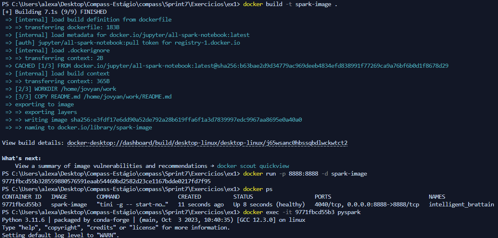
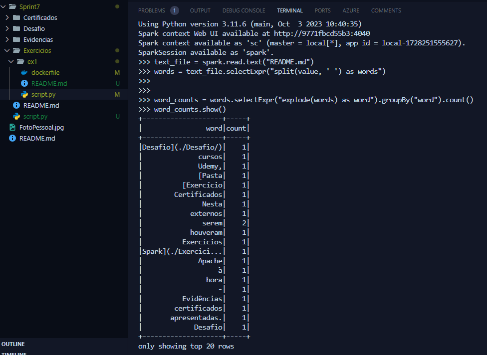

# Desafio

1. [Pasta do Desafio](./Desafio/)

# Exercícios

1. [Exercício 1 - Apache Spark](./Exercicios/ex1-spark/)

2. [Exercício 2 - AWS Lab Glue](./Exercicios/ex2-glue/)

# Evidências

Evidência 1: Exercício 1 - Apache Spark Comandos

Evidência 2: Exercício 1 - Apache Spark terminal

Evidência 3: Exercício 2 - Lab Glue

Evidência 4: Exercício 2 - Lab Glue

Evidência 5: Desafio - AWS Lambda

Evidência 6: Desafio

# Certificados

### Nesta Sprint não houveram cursos externos à Udemy, portanto não há certificados a serem apresentados.
