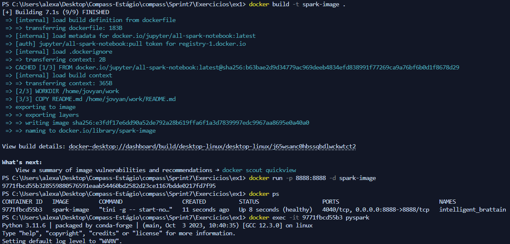
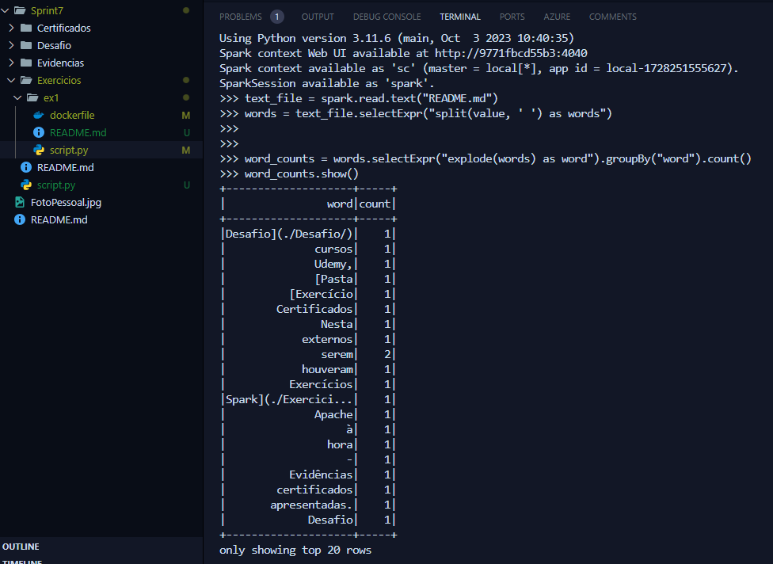
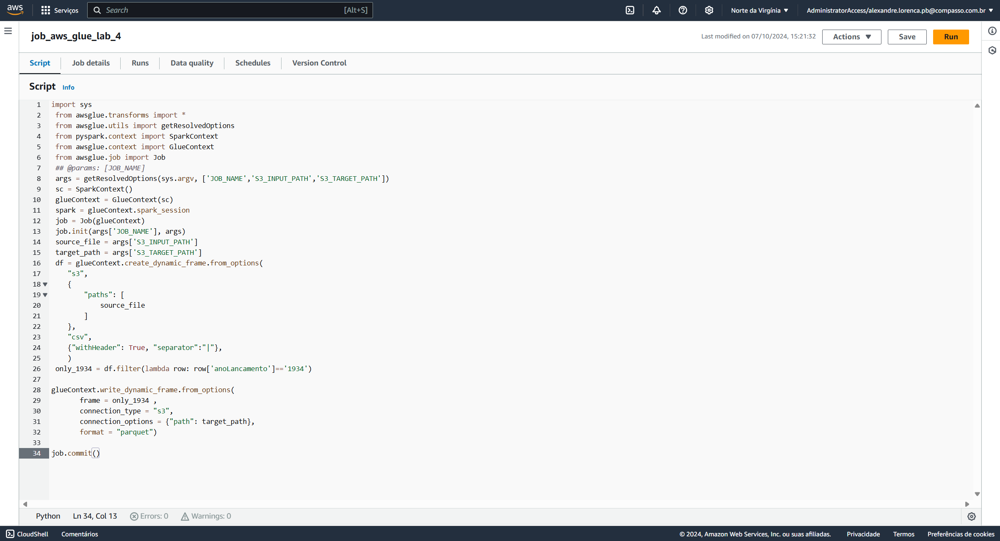
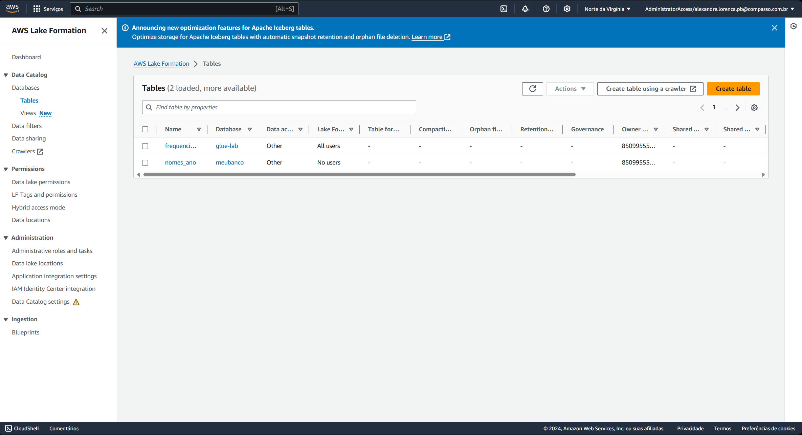
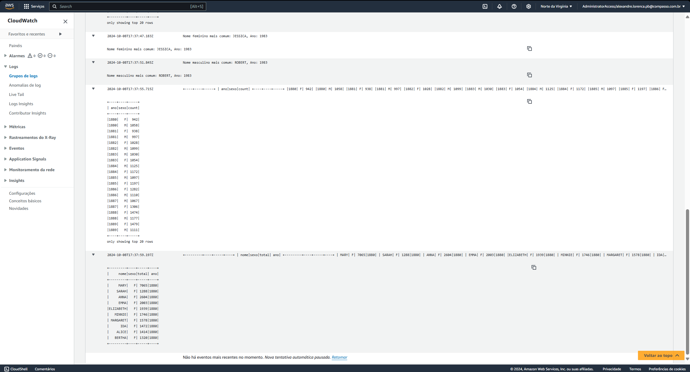
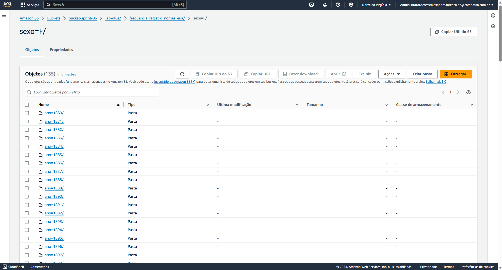
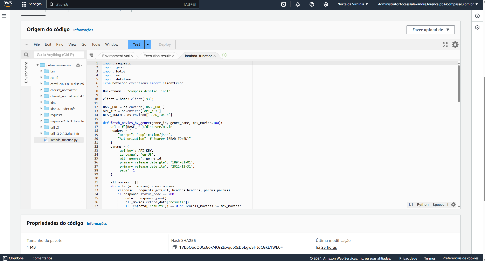
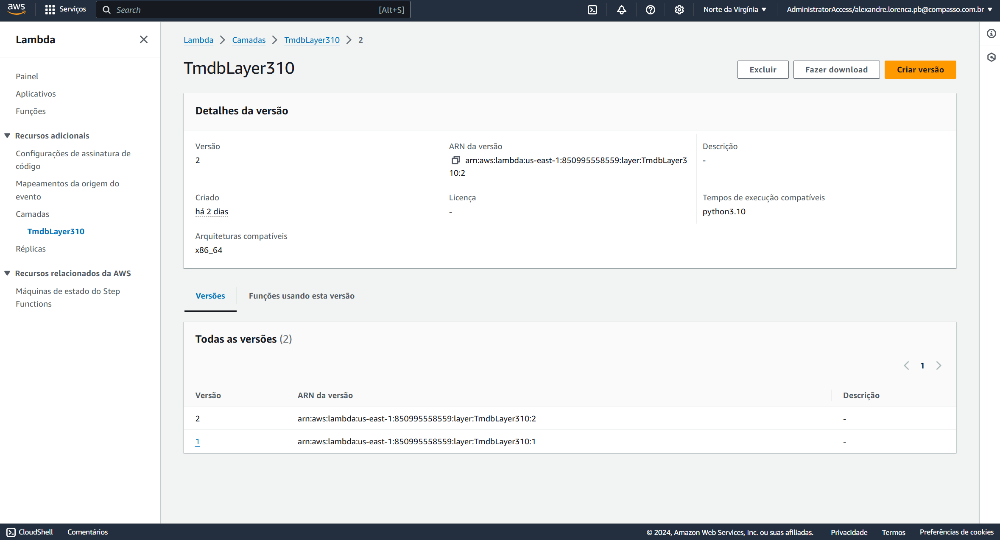
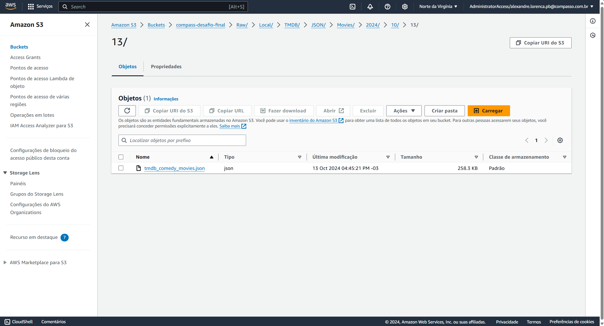
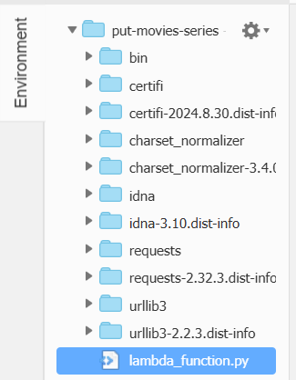

# Desafio

1. [Pasta do Desafio](./Desafio/)

# Exercícios

1. [Exercício 1 - Apache Spark](./Exercicios/ex1-spark/)

2. [Exercício 2 - AWS Lab Glue](./Exercicios/ex2-glue/)

# Evidências

### Evidências dos Exercícios está dentro da pasta Exercícios pelo grande número de imagens. Então, a pasta Evidências contém somente as evidências do Desafio.

1. [Evidências Desafio](./Evidencias/)

2. [Evidências Exercícios](./Exercicios/evidencias/)

Evidência 1: Exercício 1 - Apache Spark Comandos

Evidência 2: Exercício 1 - Apache Spark terminal

Evidência 3: Exercício 2 - Lab Glue

Evidência 4: Exercício 2 - Lab Glue

Evidência 5: Exercício 2 - Lab Glue

Evidência 6: Exercício 2 - Lab Glue

Evidência 7: Desafio - Lambda Function

Evidência 8: Desafio - Layer

Evidência 9: Desafio - S3

Evidência 10: Desafio - Pastas Lambda Function

# Certificados

### Nesta Sprint não houveram cursos externos à Udemy, portanto não há certificados a serem apresentados.
