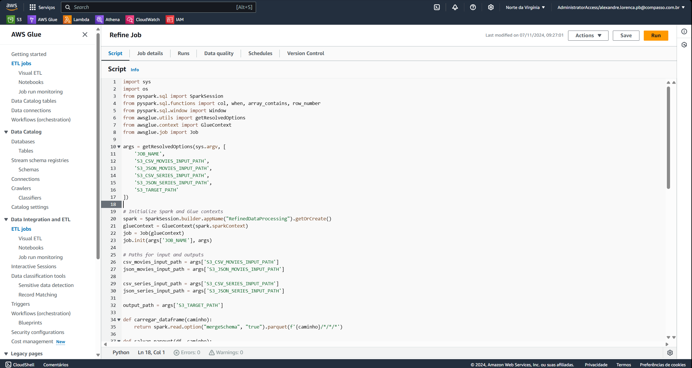
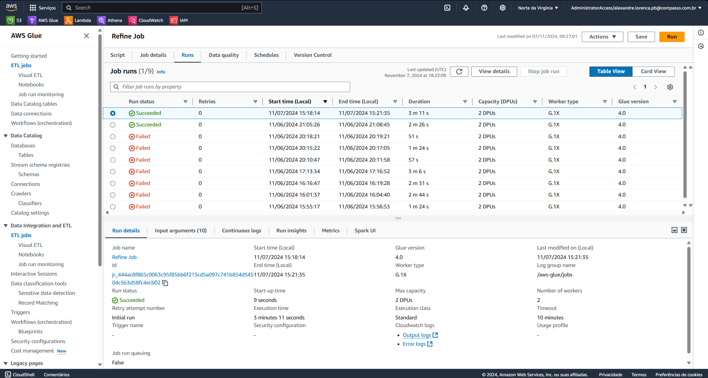
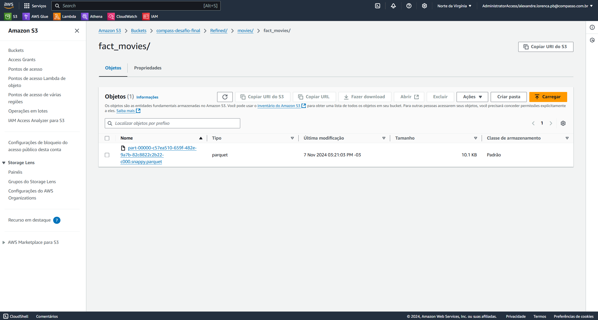
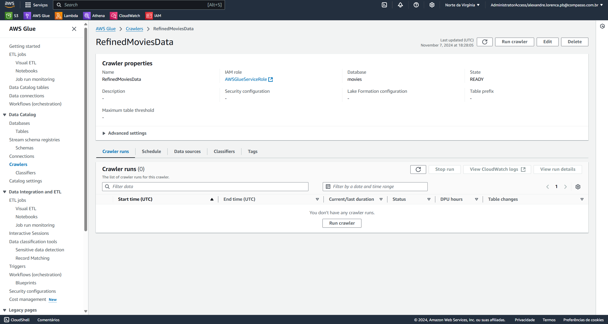
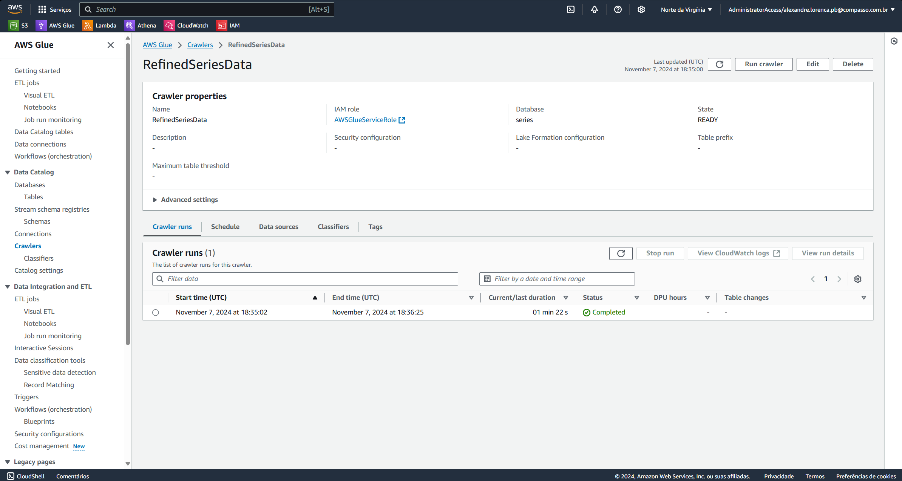
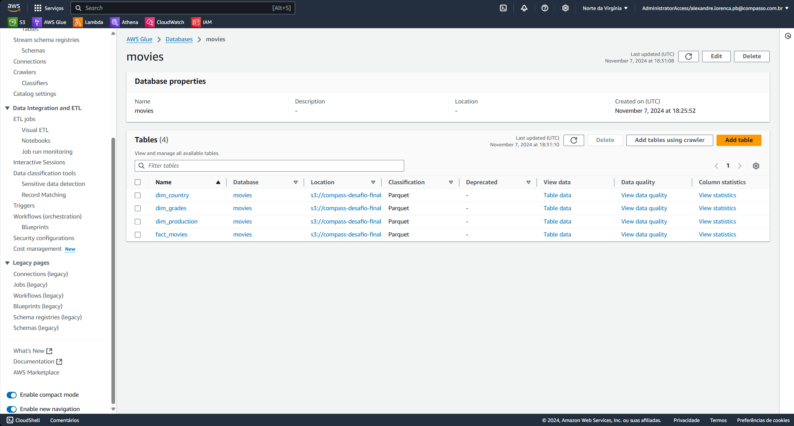
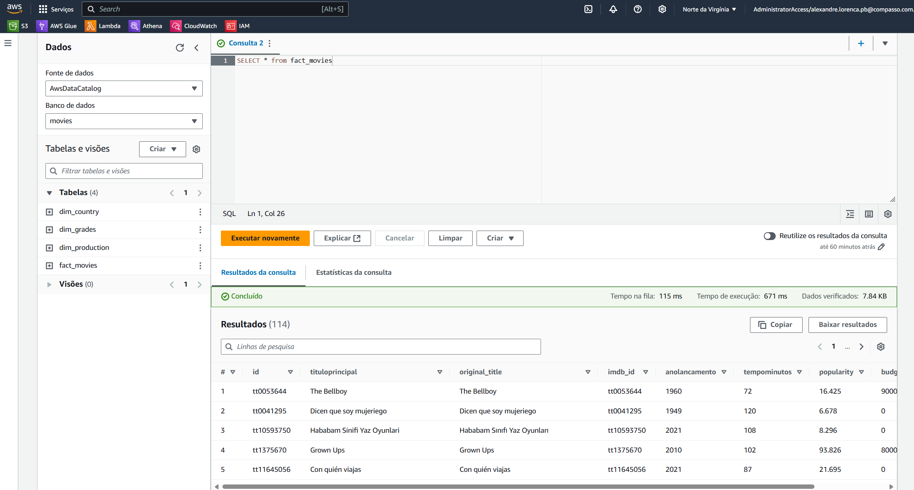
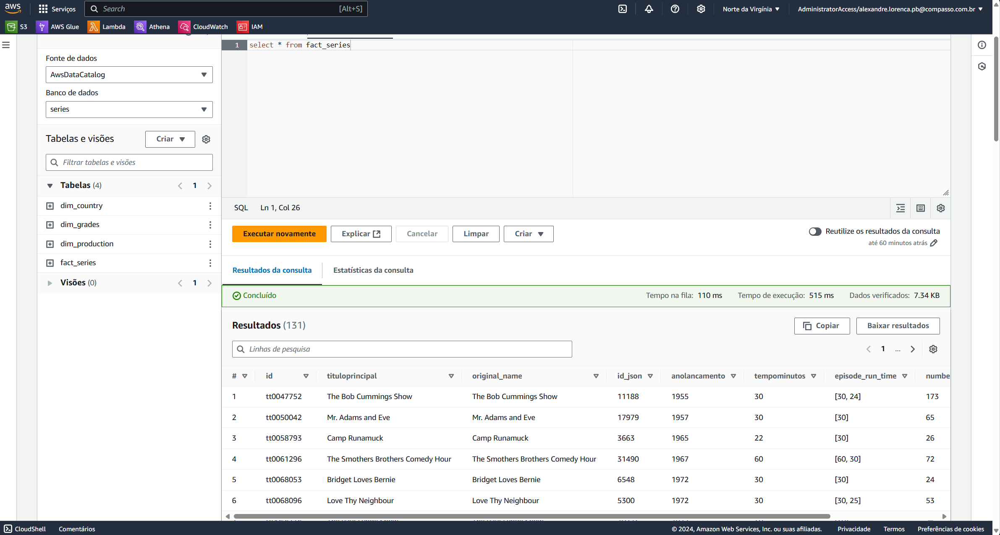
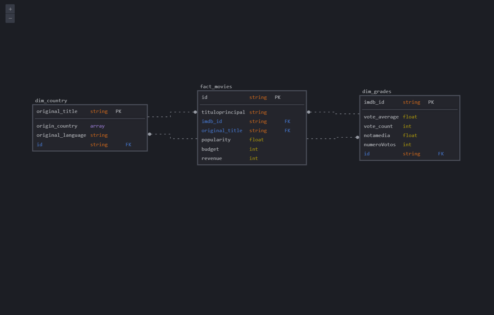
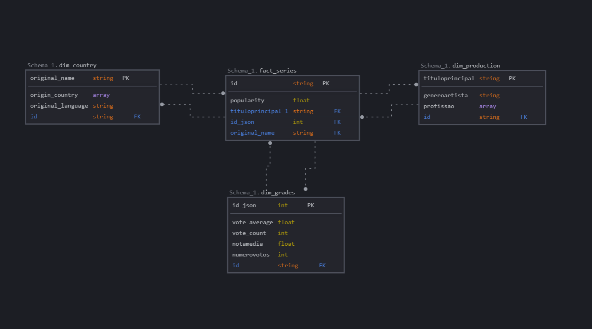

# Desafio

1. [Pasta do Desafio](./Desafio/)

## Exercícios

### Nesta Sprint não houveram exercícios para serem entregues.

## Evidências

1. [Evidências Desafio](./Evidencias/)

Evidência 1: Desafio - Script AWS Glue

Evidência 2: Desafio - Run

Evidência 3: Desafio - S3

Evidência 4: Desafio - Crawler filmes

Evidência 5: Desafio - Crawler séries

Evidência 6: Desafio - Database

Evidência 7: Desafio - Athena filmes

Evidência 8: Desafio - Athena séries

Evidência 9: Desafio - Diagrama filmes

Evidência 10: Desafio - Diagrama séries

## Certificados

### Nesta Sprint não houveram cursos externos à Udemy, portanto não há certificados a serem apresentados
